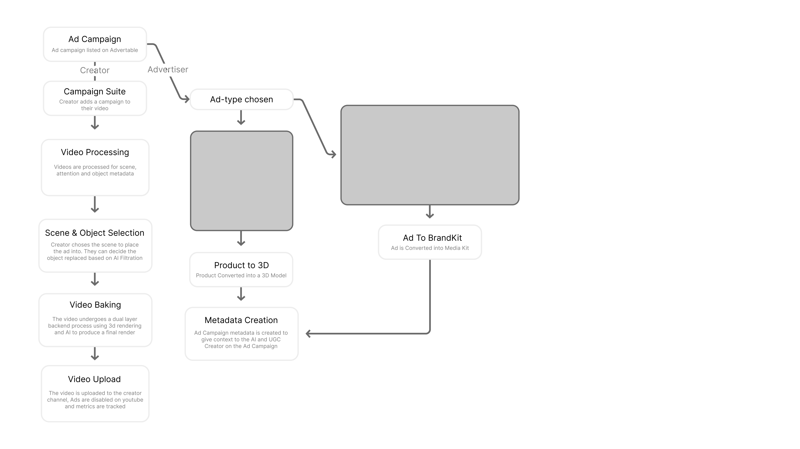

# Advertable

> Product placement, powered by AI. No mid-rolls. No overlays. No skip buttons.

## The Problem

We had a YouTube channel. The ads were embarrassing.

Not because ads are bad, but because we had zero say in what ran against our content. YouTube would surface something completely unrelated, the viewer would hit skip before five seconds, and whatever trust we had built quietly took a hit. We could not opt out. We could not curate. We just had to live with it.

So we asked a simple question: what if the ad was just in the video? Not a banner. Not a sponsored segment. The actual product, sitting on a desk or a shelf in the background, looking like it was always there. No skip button because there is nothing to skip.

That is Advertable.

## What It Does

Advertable takes a video and an advertiser's product, then places that product physically inside the footage. It finds the right moment in the video, identifies which objects in the frame are good candidates for replacement, and produces a finished video ready to go live on YouTube.

No mid-rolls. No overlays. No awkward camera pivots. The brand is already in the video.

## How It Works

### 1. Scene Analysis
The video is broken down into individual scenes. Each scene is analysed to identify objects suitable for placement, with attention-weighted scoring to ensure the product lands somewhere viewers will actually notice.

### 2. Product Placement
Once the creator confirms the placement, the product is composited into the scene with lighting and depth matching. The output looks like the product was sitting there when the camera was rolling.

### 3. Direct Upload
The finished video is pushed straight to the creator's YouTube channel via the app. YouTube ads are disabled on that upload because they are no longer needed.

## How Both Sides Work

There are two people using Advertable at the same time: the creator and the advertiser. They never need to talk to each other directly. The platform handles the handoff.

### Creator Flow

1. Browse active brand campaigns listed on Advertable
2. Pick a campaign and attach it to the video in progress
3. The system processes the video and surfaces the best candidate scenes
4. The creator chooses exactly where the product lands
5. The video renders with the product baked in
6. The finished version uploads directly to YouTube with ads turned off

### Advertiser Flow

1. Define the campaign format and how the product should appear
2. The product is converted into a format that sits convincingly inside real video scenes
3. Campaign context is packaged up so the platform and creators both understand the brief
4. Optional: use the BrandKit route to hand creators a media kit for more hands-on placements
5. Either path ends with the product in the video, looking like it belongs there

The two flows run in parallel and meet in the middle. No briefing calls. No back-and-forth. Advertable connects them automatically.

## Architecture

The diagram shows both parallel flows and where they converge.

On the left is the creator path. It starts with the ad campaign being listed on Advertable, the creator picking it up and adding it to their Campaign Suite, the video being processed for scene, attention, and object metadata, the creator selecting which scene and object to replace, the video going through a dual-layer backend render using 3D compositing and AI, and the finished video uploading to their YouTube channel with ads disabled and metrics tracked.

On the right is the advertiser path. The advertiser chooses an ad type, which splits into two routes. The standard route converts the product into a 3D model. The BrandKit route converts the ad into a media kit instead. Both paths feed into Metadata Creation, where campaign context is packaged up to give the AI and the creator everything they need to understand the brief.

The two paths meet at Metadata Creation, which is the handoff point. From there the creator has everything required to place the product and render the final video. Neither side needs to coordinate directly.

## Why We Built on Render

Video processing is genuinely heavy work. Scene analysis, object detection, compositing, and re-encoding a finished file are not tasks you can run on a laptop mid-demo and expect to survive. We needed infrastructure that could handle real computational load, stay up reliably, and scale without requiring us to rebuild anything.

Render was the right call for three reasons.

**Deployment took minutes, not hours.** We connected the repo, set the environment variables, and Render handled the rest. No server configuration. No nginx wrestling. No Docker rabbit holes at 2am. The service was live and handling requests faster than we could have spun up an EC2 instance.

**It held up when it mattered.** Video workloads are bursty. A request comes in, hammers CPU and memory for 30 to 60 seconds, then goes quiet. Render handled that pattern without falling over, without throttling us mid-demo, and without any manual intervention on our end. For a hackathon build that needed to work in front of judges on the day, that reliability was not optional.

**Scaling is not a rebuild.** Right now Advertable processes one video at a time while rendering happens synchronously. Moving to background job queues, adding workers, and handling concurrent renders is straightforward on Render because the infrastructure grows with the code. We do not need to migrate to a different platform the moment usage picks up. We just adjust the plan and deploy.

That combination of zero-friction setup, production-grade reliability under load, and a clear path to scale made Render the obvious foundation for something that processes real video and needs to actually work.

## Tech Stack

| Layer | Technology |
|---|---|
| Backend | Python |
| Video Processing | Scene analysis, object detection, compositing pipeline |
| Deployment | Render |
| YouTube Integration | YouTube Data API v3 |
| Creator Interface | Web app with upload and preview flow |

## Current State

Built at a hackathon, so being honest: the whole thing works end to end. You can put a real video in, confirm a placement, and get a finished output back with the product sitting inside the footage. Quality varies depending on the scene, particularly in difficult lighting or with a moving camera.

### What Still Needs Work

- Placement quality in harder lighting conditions
- Longer videos block the pipeline while they render synchronously

## What Is Next

- Background job queues so videos process asynchronously and nothing stalls
- A campaign browser where creators can discover and pick up advertiser deals
- Improved lighting and depth matching for more convincing placements in complex scenes
- BrandKit output so advertisers can hand creators assets directly

## Built By

Enaiho, Kris and Kiara
